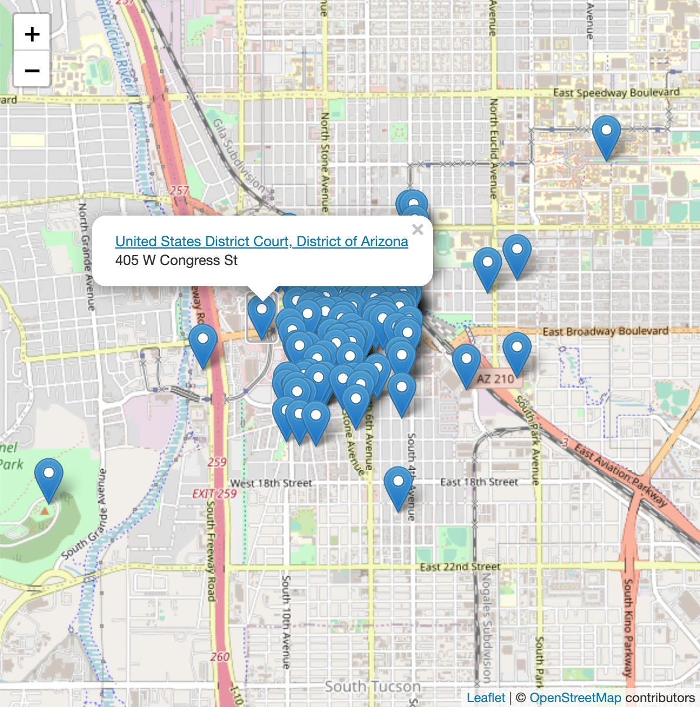
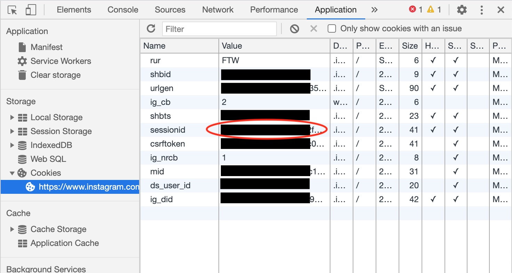

# Instagram Location Search

## Prerequisites

This Python application requires `requests` and `numpy` to be properly installed. This can be done with `pip3 install requests numpy`.

## Example usage

The following command will search for Instagram locations nearby the coordinates 32.22 N, 110.97 W (downtown Tucson, Arizona.) The list of locations is saved as a JSON file at "locs.json".

```python3 instagram-locations.py --session "<session-id-token>" --lat 32.22 --lng -110.97 --json locs.json```

Note that this requires an Instagram session ID in order to work! See below for how to obtain one from your account.

### Other output formats

Using the `--csv <output-location>` command line argument, the list can be saved as a CSV file.

Using the `--geojson <output-location>` command line argument, the list can be saved as a GeoJSON file for other geospatial applications.

Using the `--map <output-location>` command line argument, a simple Leaflet map is made to visualize the locations of the returned points.



Multiple types of output can be generated. For example, the following command will search for Instagram locations, save the JSON list, a CSV file, and a map for viewing the locations visually.

```python3 instagram-locations.py --session "3888090946%3AhdKd2fA8d72dqD%3A16" --lat 32.22 --lng -110.97 --json locs.json --csv locs.csv --map map.html```

## Getting an Instagram session ID

__Important: an Instagram session ID should be treated like a password — it provides full access to the Instagram account. Using this session ID in multiple places or on multiple computers may trigger Instagram to invalidate all session IDs. Using this session ID for any purpose other than the official Instagram website or application may be a violation of the Instagram Terms of Service and could lead to account suspension.__

1. In Google Chrome, log-in to Instagram.
2. Right click on the page and press "Inspect" to bring up the Chrome Developer Tools.
3. Click the "Application" tab in the Developer Tools Box.
4. Under "Cookies" select "https://www.instagram.com."
5. The value next to "sessionid" is your Instagram session ID.


